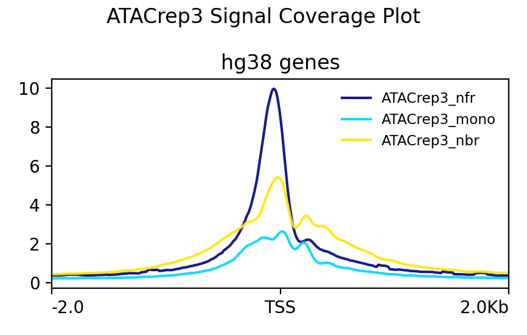
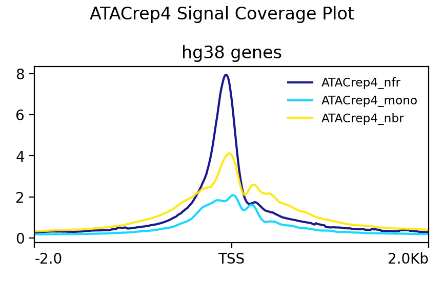
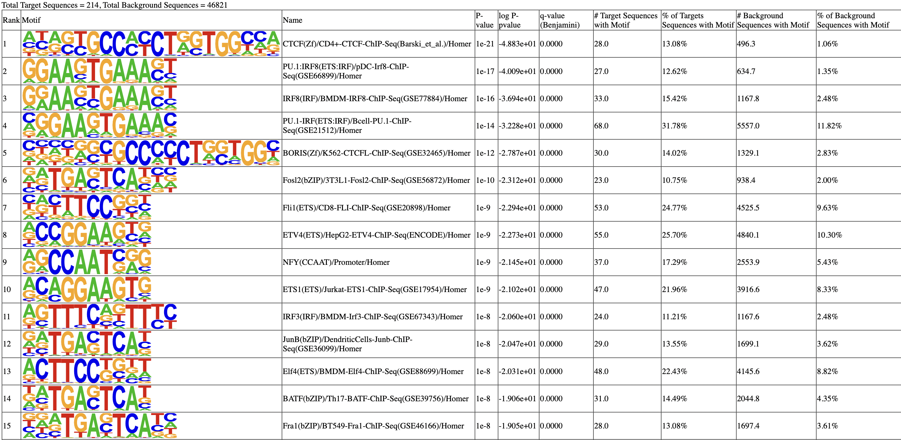

```{r setup, include=FALSE}
knitr::opts_chunk$set(echo = TRUE)
```
# Methods 

The FASTQ files were inspected for quality control using fastqc v0.12.1-0 with default parameters (fastqc --threads 16 <atacseq.fastq> -o <results/directory>) (1). Once QC checked, the reads were trimmed of adapters using trimmomatic v0.39 with in paired-end mode (trimmomatic PE -threads 16 <atacseq_r1.fastq> <atacseq_r2.fastq> <output.paired1> {output.unpaired1} {output.paired2} {output.unpaired2} ILLUMINACLIP:Nextera:2:30:10 LEADING:3 TRAILING:3 SLIDINGWINDOW:4:15) (2). Bowtie2 v2.5.3 was used to create an index of the entire human genome using the GENCODE hg38 primary assembly for use in alignment, with default parameters. Alignment was also performed using Bowtie2 v2.5.3 with the -X 2000 flag (3), and the alignment output was converted to bam format using samtools v1.19.2 with default parameters (4). 
The alignment bam files were filtered to remove mitochondrial genes, sorted, and indexed using samtools v1.19.2, following default parameters (4). Alignment quality control was performed using samtools v1.19.2 flagstats with default parameters (4). All QC reports generated thus far (FastQC and flagstats) were concatenated using multiqc v1.20 (5). The sorted bam files were converted to BigWig format using deeptools v3.5.4 bamCoverage with default parameters (6). 

After this filtering, reads were shifted to account for tagmentation process bias using deeptools v3.5.4 alignmentSieve with the --ATACshift flag (6) with the GENCODE hg38 blacklist bed file (7). The R package ATACseqQC was used to determine fragment distribution sizes for all samples (8). Peak calling was performed on each replicate using MACS3 callpeak with default parameters (9). Reproducible peaks were identified using bedtools v2.31.1 intersect with the -f 0.50 -r flag to select peaks that have at least 50% overlap between replicates (10). Signal-artifact regions were filtered from this bed file using the ENCODE blacklist with bedtools v2.31.1 (10).

The filtered peaks were annotated to their nearest genomic feature using HOMER v4.11 annotatepeaks with the GENCODE primary assembly gtf file (11). Motifs were identified using HOMER v4.11 findMotifsGenome with the GENCODE hg38 primary assembly fasta file (11). The annotated peaks were used to identify a list of proximal genes. This list of genes was used to perform functional enrichment analysis using HOMER v4.11 annotatepeaks with the -go flag. 

The score matrix for each replicate was computed using deeptools v3.5.4 computeMatrix and with reference genomic coordinates for the entire genome extracted from the UCSC Table Browser (selections: Clade: Mammal, Genome: Human, assembly: hg38, group: Genes and Gene Predictions, track: NCBI RefSeq, table: UCSC Refseq, region: genome). This score matrix was used to plot signal coverage for each replicate with deeptools v3.5.4 plotProfile, with default parameters.

# Results 
## Sequence QC

Sequence quality control was performed using FASTQC. No glaring sequence quality concerns were observed. While FASTQC flagged the sequence duplication levels as abnormal, the duplication level was <30%, which is acceptable for ATAC-seq samples. Additionally,the Per Base Sequence Content report was flagged as abnormal because of an overrepresentation os C and T at the beginning of the reads. This pattern was present in each replicate and each read. This is likely due to the presence of the Nextera transposase adapter, and will be trimmed in subsequent analysis. 

## Alignment QC

Alignment quality control was performed using Samtools flagstats. There were no major alignment quality issues that would call for the exclusion of a sample. Notably, there was a very high incidence of reads mapped to the mitochondrial genome. These reads were filtered out for subsequent analysis. 

### Alignment Statistics 
Counts are in millions 

```{r, echo=FALSE}
data <- data.frame(
  Sample = c("ATACrep3", "ATACrep4"),
  pre_mito_filter_count = c(150.1,111.1),
  post_mito_filter_count = c(38.6,29.4),
  mito_alignments = c(111.5,81.7)
)

# Print the table
knitr::kable(data)

# Create some sample data
data <- data.frame(
  Sample = c("ATACrep3", "ATACrep4"),
  pre_mito_filter_count = c(150.1,111.1),
  post_mito_filter_count = c(38.6,29.4),
  mito_alignments = c(111.5,81.7)
)

# Print the table with custom labels
knitr::kable(data, col.names = c("Sample", "All alignments", "Alignments after mitochondria filtered out", "Mitochondrial Alignments"))


```

## Fragment Length Distribution Plots 

```{r echo=TRUE, message=FALSE, warning=FALSE}
library(ATACseqQC)

#define the filepaths for bam and index for each replicate
rep3_bamfile <- "ATACrep3_shifted_sort.bam"
rep3_index <- "ATACrep3_shifted_sort.bam.bai"

rep4_bamfile <- "ATACrep4_shifted_sort.bam"
rep4_index <- "ATACrep4_shifted_sort.bam.bai"

# calculate and plot fragment size distribution
rep3_plot <- fragSizeDist(rep3_bamfile, rep3_index)
rep4_plot <- fragSizeDist(rep4_bamfile, rep4_index)
```

## Peak Calling 

How many peaks are present in each of the replicates?
ATACrep3 had 30049 peaks and ATACrep4 had 26139 peaks.While many peaks were identified in the individual samples, only 214 were identified as reproducible. This was defined as having 50% similarity between ATACrep3 and ATACrep4. Since I filtered out the blacklisted regions after alignment, (in the bam file), no blacklisted regions were present in my peaks. I checked this by using samtools to filter out the blacklisted region peaks, and the number of peaks was the same. 
    
```{r echo=FALSE}
data <- data.frame(
  Sample = c("ATACrep3", "ATACrep4"),
  peak_count = c(30049,26139),
  reproducible_peaks = c(214,214)
)


# Print the table
knitr::kable(data, col.names = c("Sample", "Peak count", "Reproducible Peaks"))

```

## Signal Coverage 
Signal coverage plots for the nucleosome free regions (nfr), mononucleated regions (mono), and nucleosome-bound regions (nbr)

```{r echo=FALSE}


```


A single BED file containing the reproducible peaks you determined from the experiment.
```{r}

```

## Motif finding 
Perform motif finding on your reproducible peaks

Create a single table / figure with the most interesting results

```{r echo=FALSE, results='asis'}

```

## Gene Ontology 

Perform a gene enrichment analysis on the annotated peaks using a well-validated gene enrichment tool

Create a single table / figure with the most interesting results

```{r message=FALSE, warning=FALSE}
# Load required libraries
library(ggplot2)
library(tidyverse)
library(readr)

# Read your gene ontology data from the text file
go_list <- read_csv("gene_ont.csv")
go_filter <- go_list %>%
  mutate(p.adjust = p.adjust(p = `P-value`, method = "BH"))%>%
  dplyr::filter(p.adjust < 0.05)

subset_go_list <- go_list %>%
  arrange(`P-value`) %>%   # Sort by p-value ascending
  slice(1:15)%>%
  mutate(GeneRatio = `# of Target Genes in Term`/`# of Target Genes`)
  
ggplot(data = subset_go_list, aes(x = GeneRatio, y = Term, color = `P-value`, size = `# of Target Genes in Term`)) + 
  geom_point()+
  scale_color_gradient(low = "red", high = "blue") +
  scale_x_continuous(labels = function(x) sprintf("%.2f", x), breaks = seq(0, 0.22, by = 0.1))  +
  theme_bw() +
  ylab("") +
  xlab("Gene Ratio") +
  ggtitle("GO enrichment for Peaks")+ 
  expand_limits(x = c(-0.01,.21))
```


## Proportion of regions that have accessible chromatin called as a peak

```{r message=FALSE, warning=FALSE}
library(tidyverse)
library(ggplot2)
peaks <- read_delim("annotated_peaks.txt", delim = "\t", col_names = TRUE) 

tts <- nrow(peaks[peaks$Annotation %in% grep("TTS", peaks$Annotation, value = TRUE), ])/nrow(peaks)
intron <- nrow(peaks[peaks$Annotation %in% grep("intron", peaks$Annotation, value = TRUE), ])/nrow(peaks)
promoter_tss <- nrow(peaks[peaks$Annotation %in% grep("promoter-TSS", peaks$Annotation, value = TRUE), ])/nrow(peaks)
intergenic <- nrow(peaks[peaks$Annotation %in% grep("Intergenic", peaks$Annotation, value = TRUE), ])/nrow(peaks)
exon <- nrow(peaks[peaks$Annotation %in% grep("exon", peaks$Annotation, value = TRUE), ])/nrow(peaks)


# Assuming you've read the data already
annotations <- c("TTS", "Intron", "Promoter-TSS", "Intergenic", "Exon")
proportions <- c(tts, intron, promoter_tss, intergenic, exon)

# Create a data frame
annotation_df <- data.frame(Annotation = annotations, Proportion = proportions)

# Sort the dataframe for better visualization
annotation_df <- annotation_df %>% arrange(desc(Proportion))

# Prepare data for ggplot
annotation_df$labels <- paste(round(annotation_df$Proportion * 100, 1), "%", sep = "")

# Plotting

ggplot(annotation_df, aes(x = Annotation, y = Proportion, fill = Annotation)) +
  geom_bar(stat = "identity", fill = "#7dd7f0") +
  geom_text(aes(label = labels), vjust = 0, hjust = -0.15, size = 3.5) +  
  theme_minimal() +
  theme(axis.text.x = element_text(angle = 45, hjust = 1)) +  
  labs(x = "Region", y = "Proportion of peaks") +  
  coord_flip() +  
  guides(fill = FALSE) +  # Remove the legend
  expand_limits(y = 0.45) 


```


# References 

1. Andrews, S. (2010). FastQC: a quality control tool for high throughput sequence data. Available online at: http://www.bioinformatics.babraham.ac.uk/projects/fastqc/ 
2. Bolger, A. M., Lohse, M., & Usadel, B. (2014). Trimmomatic: a flexible trimmer for Illumina sequence data. Bioinformatics (Oxford, England), 30(15), 2114–2120. https://doi.org/10.1093/bioinformatics/btu170
3. Langmead, B., & Salzberg, S. L. (2012). Fast gapped-read alignment with Bowtie 2. Nature methods, 9(4), 357–359. https://doi.org/10.1038/nmeth.1923
4. Li, H., Handsaker, B., Wysoker, A., Fennell, T., Ruan, J., Homer, N., Marth, G., Abecasis, G., Durbin, R., & 1000 Genome Project Data Processing Subgroup (2009). The Sequence Alignment/Map format and SAMtools. Bioinformatics (Oxford, England), 25(16), 2078–2079. https://doi.org/10.1093/bioinformatics/btp352
5. Ewels, P., Magnusson, M., Lundin, S., & Käller, M. (2016). MultiQC: summarize analysis results for multiple tools and samples in a single report. Bioinformatics (Oxford, England), 32(19), 3047–3048. https://doi.org/10.1093/bioinformatics/btw354
6. Fidel Ramírez, Friederike Dündar, Sarah Diehl, Björn A. Grüning, Thomas Manke, deepTools: a flexible platform for exploring deep-sequencing data, Nucleic Acids Research, Volume 42, Issue W1, 1 July 2014, Pages W187–W191, https://doi.org/10.1093/nar/gku365
7. Amemiya, H.M., Kundaje, A. & Boyle, A.P. The ENCODE Blacklist: Identification of Problematic Regions of the Genome. Sci Rep 9, 9354 (2019). https://doi.org/10.1038/s41598-019-45839-z
8. Ou, J., Liu, H., Yu, J. et al. ATACseqQC: a Bioconductor package for post-alignment quality assessment of ATAC-seq data. BMC Genomics 19, 169 (2018). https://doi.org/10.1186/s12864-018-4559-3
9. Zhang, Y., Liu, T., Meyer, C.A. et al. Model-based Analysis of ChIP-Seq (MACS). Genome Biol 9, R137 (2008). https://doi.org/10.1186/gb-2008-9-9-r137
10. Aaron R. Quinlan, Ira M. Hall, BEDTools: a flexible suite of utilities for comparing genomic features, Bioinformatics, Volume 26, Issue 6, March 2010, Pages 841–842, https://doi.org/10.1093/bioinformatics/btq033
11. Heinz S, Benner C, Spann N, Bertolino E et al. Simple Combinations of Lineage-Determining Transcription Factors Prime cis-Regulatory Elements Required for Macrophage and B Cell Identities. Mol Cell 2010 May 28;38(4):576-589. PMID: 20513432

